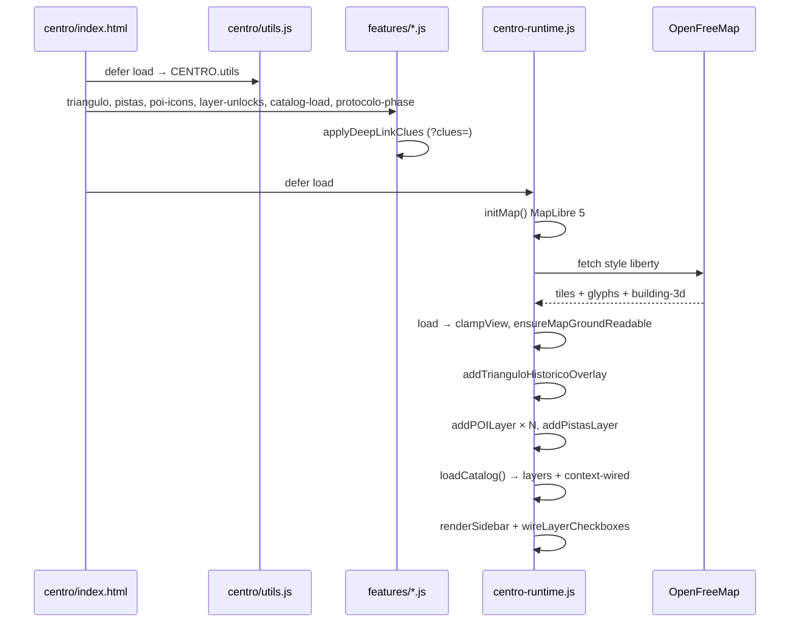

# Fluxo de inicialização — Centro (MapLibre)

> Execution map referenciado em `AGENT.md` §5.5 e §10.



## Ordem de scripts (`centro/index.html`)

1. MapLibre vendor + `theme.js`, `map-icons.js`, renderers
2. `centro/utils.js`
3. `features/triangulo-historico.js`, `pistas.js`, `poi-icons.js`
4. `features/layer-unlocks.js` (deep-link caderno)
5. `features/catalog-load.js` (layers + context wired)
6. `features/protocolo-phase.js` (`protocolo13_phase`)
7. `centro-runtime.js`

## Catálogo sidebar

| Fonte | Ficheiros | Camadas |
|---|---|---|
| Processed | `layers.json` + `groups.json` | 10 (incl. ZEIS-2 viewport) |
| Context wired | `context-layers.json` + `context-wired.json` + `context-groups.json` | 14 (OSM ruas/endereços + 12) |
| Locks | `layer-unlocks.json` + `protocolo13_caderno_clues` | subset |

## Dados OSM / ZEIS (origem `mapa_sp_salto`)

```bash
npm run sync:geojson-from-salto   # clip ao polígono 16_regiao_centro (+ ZEIS-2 ao bbox do mapa)
```

Requer `shapely` (`pip install shapely`) e o repo irmão em `../mapa_sp_salto`.

## Smoke manual

Ver [../testing/smoke-centro.md](../testing/smoke-centro.md).
