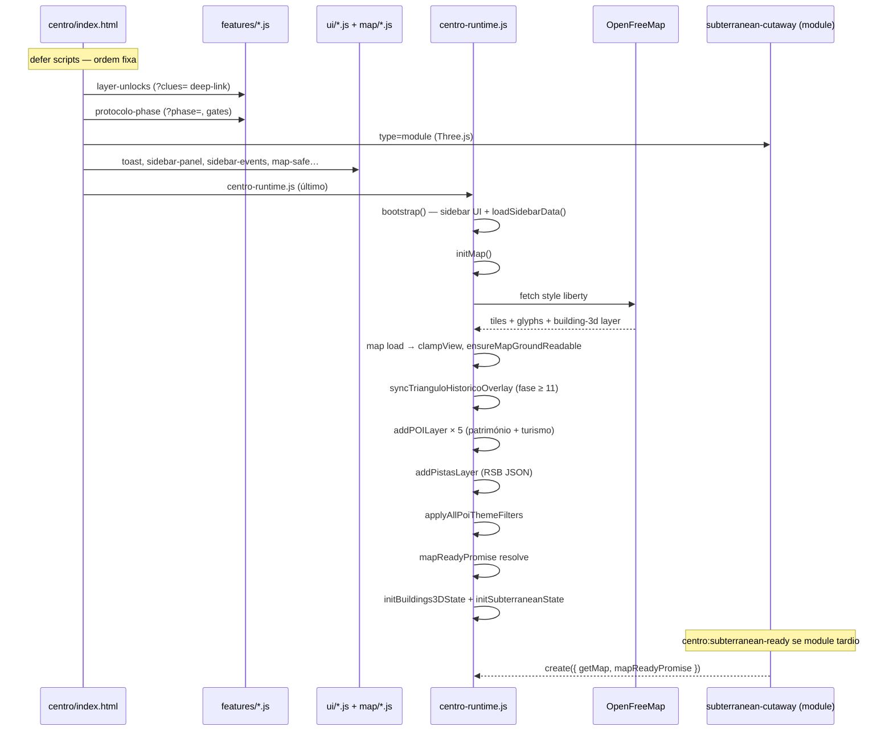

# Fluxo de inicialização — Centro (MapLibre)

> Execution map referenciado em `AGENT.md` §5.5 e §10.  
> **Verificado:** 2026-07-05 · commit pós-resync triângulo + `resyncArgStateConsumers`.

## Duas fases de boot

O Centro arranca em **duas fases paralelas** que convergem quando o mapa dispara `load`:

| Fase | Quando | O quê |
|------|--------|-------|
| **DOM** | `DOMContentLoaded` → `bootstrap()` | UI sidebar, tabs, toggles, guia, listeners ARG |
| **Mapa** | `bootstrap()` → `initMap()` → `map.on("load")` | OpenFreeMap, POIs, pistas, triângulo, 3D/subsolo |



## Ordem de scripts (`centro/index.html`)

Scripts com `defer` executam **na ordem do HTML** antes de `DOMContentLoaded`.

| # | Bloco | Ficheiros |
|---|--------|-----------|
| 0 | Chrome | `surface-links.js` |
| 1 | Vendor mapa | `maplibre-gl.js` |
| 2 | Design system | `theme.js`, `knowledge.js`, `map-icons.js`, `ui-texts.js`, utils, `popup-renderer.js` |
| 3 | Centro utils | `centro/utils.js` → `window.CENTRO.utils` |
| 4 | Features | `triangulo-historico`, `pistas`, `poi-icons`, `buildings-3d`, `poi-theme-filter`, `layer-unlocks`, `catalog-load`, `protocolo-phase`, **`arg-resync`**, `sidebar-layer-state` |
| 5 | Subsolo | `subterranean-cutaway.js` (**`type="module"`**) |
| 6 | UI | `toast`, `lazy-assets`, `map-popups`, `sidebar-panel`, `sidebar-phases-panel`, `sidebar-events`, **`sidebar-orchestrator`** |
| 7 | Map infra | `map-safe`, `layer-data-url`, `catalog-layer-controller`, `symbol-popup-layer`, **`poi-bootstrap`**, **`triangulo-overlay`** |
| 8 | Runtime | **`centro-runtime.js`** (orquestrador) |

**Nota:** `rio-animado.js` **não** está na lista — só em `centro/test-full.html`.

## `bootstrap()` — ordem interna

```text
setupHamburgerMenu
setupSidebarTabs          → tab default: Território (#sidebar-tab-camadas)
setupSidebarToggle
setupBuildings3DToggle / setupSubterraneanToggle / setupSubterraneanFlyButtons
setupPoiThemeFilter
setupNarrativeNav
setupCentroUiFromModules  → sidebar-events delegação
setupKeyboardShortcuts    → tecla S
setupSubterraneanGuide    → botões #subterranean-guide-open(+fases)
setupArgStateListener     → arg-resync.install() (centro:arg-state-changed + storage)
loadSidebarData           → sidebar-orchestrator.load() (catalog-load + render + wire)
initMap()
```

## `map.on("load")` — ordem interna

1. `clampViewToCentroBounds` — hash URL vs `CENTRO_MAX_BOUNDS`
2. `ensureMapGroundReadable` — fundo `#f8f4f0` no layer `background`
3. `syncTrianguloHistoricoOverlay` — add se fase ≥ 11; skip se source já existe
4. `addPOILayer` × 5 (memória, acervo, arqueologia, monumentos, turismo)
5. `fetch` pistas RSB → `addPistasLayer` → `setupPistasRsbToggle`
6. `applyAllPoiThemeFilters`
7. Debug inspector (só `?debug=1` ou `centroDebug`)
8. `mapReadyPromise` resolve
9. `initBuildings3DState` / `initSubterraneanState`

## Resync de gates ARG

Quando a fase ou o caderno mudam, **`arg-resync.resync()`** (via `centro:arg-state-changed` ou `storage`) reaplica:

| Consumidor | Módulo |
|------------|--------|
| Sidebar Território + 13 Almas | `sidebar-orchestrator.load()` via `loadSidebarData()` |
| Filtro temático Evidências | `poi-theme-filter.syncPhaseGate` |
| Maquete 3D | `buildings-3d.syncPhaseGate` |
| Pistas RSB | `pistas.syncPhaseGate` |
| Visão subterrânea | `subterranean-cutaway.syncPhaseGate` |
| Triângulo Histórico | `triangulo-overlay.sync()` via `syncTrianguloHistoricoOverlay()` |

**Disparadores:**

- `document` event `centro:arg-state-changed` (ex.: `protocolo-phase.setPhase`)
- `window` event `storage` — chaves `protocolo13_caderno_clues`, `protocolo13_phase` (outra aba)

## Catálogo sidebar (Território)

| Fonte | Ficheiros | Camadas wired |
|-------|-----------|---------------|
| Processed | `layers.json` + `groups.json` | **10** |
| Context | `context-wired.json` + `context-groups.json` | **10** |
| Exclusão UI | `sidebar-exclude.json` | −4 POI duplicados (continuam via `addPOILayer`) |
| **Total sidebar** | | **20 camadas**, **9 grupos** |

Inventário extra (não wired na sidebar): `context-layers.json` (referência).

### Locks sobrepostos

| Mecanismo | Ficheiro | Efeito |
|-----------|----------|--------|
| Pista Caderno | `layer-unlocks.json` | `.layer-row--clue-locked` |
| Fase ARG | `phase-gates.json` → `layerMinPhase` | `.layer-row--phase-locked` |
| Feature | `featureMinPhase` | toggles 3D / RSB / subsolo disabled |

**Subsolo (gate composto):** fase ≥ 7 **e** pistas `agua-calada`, `aresta-fria`, `peso-fundacao` — ver `subterranean-cutaway.js`.

## Sidebar — 4 tabs

| Tab | ID DOM | Conteúdo principal |
|-----|--------|-------------------|
| 13 Almas | `#sidebar-tab-fases` | `#phases-panel`, botão guia missão |
| Visualização | `#sidebar-tab-opcoes` | 3D, subsolo, guia missão |
| Território | `#sidebar-tab-camadas` | 20 camadas, 3 secções narrativas |
| Evidências | `#sidebar-tab-pois` | Filtro temático POI + toggle RSB |

Tab activa por defeito: **Território**.

## Namespace global (runtime)

| Símbolo | Origem |
|---------|--------|
| `window.CENTRO.*` | features, ui, map modules |
| `window.CENTRO_POIS` | flyTo OP:* (runtime) |
| `window.MAPA_SP_ICONS` | `map-icons.js` |
| `window.MAPA_SP_POPUP` | popups DOM-safe |
| `window.centroToast` | `ui/toast.js` |

## Dados OSM / ZEIS (origem `mapa_sp_salto`)

```bash
npm run sync:geojson-from-salto   # clip ao polígono 16_regiao_centro (+ ZEIS-2 ao bbox)
```

Requer `shapely` e repo irmão `../mapa_sp_salto`. Output **commitado** em `centro/data/`.

## Próximo passo estrutural

Plano para fatiar `centro-runtime.js`: [runtime-refactor-plan.md](./runtime-refactor-plan.md).

## Smoke manual

Ver [../testing/smoke-centro.md](../testing/smoke-centro.md).
