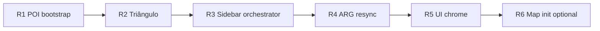

# Plano de refactor — `centro-runtime.js`

> **Estado:** em curso — **R1–R5 ✓** (2026-07-05). R6 opcional pendente.  
> **Objectivo:** reduzir o monólito (~1 180 linhas) sem bundler, mantendo IIFE + ordem de scripts.  
> **Referência:** [map-init-flow.md](./map-init-flow.md).

## Situação actual

| Métrica | Valor |
|---------|-------|
| Linhas `centro-runtime.js` | ~960 (−220 após R1) |
| Funções no ficheiro | ~55 |
| Já extraído | `features/*`, `ui/*`, `map/*` |
| Ainda no runtime | init mapa, POI boot, sidebar glue, flyTo, debug, bootstrap |

### Mapa de responsabilidades (hoje)

```text
centro-runtime.js
├── Constantes + estado (map, activeLayers, mapReadyPromise)
├── Delegates map-safe (ensureSource/Layer/Image)
├── Lock helpers (clue + fase → resolveSidebarLockState)
├── POI boot → `map/poi-bootstrap.js` (R1 ✓)
├── initMap + map.on("load")                    ← ~170 linhas
├── Triângulo sync → `map/triangulo-overlay.js` (R2 ✓)
├── Sidebar glue → `ui/sidebar-orchestrator.js` (R3 ✓)
├── Feature API bridges (ensure*Api, toggles)   ← ~120 linhas
├── UI bootstrap → `ui/centro-chrome.js` (R5 ✓)
├── ARG resync → `features/arg-resync.js` (R4 ✓)
└── flyTo, inspector, CENTRO_POIS               ← ~100 linhas
```

## Princípios do refactor

1. **Sem bundler** — cada extract = novo `<script defer>` + `window.CENTRO.<ns>`.
2. **Runtime fino** — só orquestração: `bootstrap()`, `initMap()`, wiring entre módulos.
3. **Testes primeiro** — cada PR move código **e** adiciona asserts em `sanity.test.js`.
4. **PRs pequenos** — uma fatia por PR (~150–250 linhas movidas max).
5. **Sem mudar comportamento** — refactor puro até a fatia estar verde em `npm run ci`.

## Fases propostas

### Fase R1 — POI bootstrap ✅ (concluída)

**Novo:** `centro/map/poi-bootstrap.js` — `window.CENTRO.poiBootstrap.create(deps)` + `bootMapLayers(map, hooks)`.

| Move | De | Para |
|------|-----|------|
| `addPOILayer` | runtime | poi-bootstrap |
| `addPistasLayer` | runtime | poi-bootstrap |
| `pistaItemFromProperties` | runtime | poi-bootstrap |
| Bloco `poiConfigs` + loop no `map.on("load")` | runtime | `poi-bootstrap.bootMapLayers(map, deps)` |

**Runtime fica:** `await CENTRO.poiBootstrap.bootMapLayers(map, { buildLayerDataUrl, … })`.

**Ganho:** ~220 linhas. **Risco:** médio (popups, ícones SVG). **Testes:** mock map já existe em `symbol-popup-layer` — estender.

---

### Fase R2 — Triângulo overlay ✅ (concluída)

**Novo:** `centro/map/triangulo-overlay.js` — `window.CENTRO.trianguloOverlay.create(deps)` + `add` / `remove` / `sync`.

| Move | De | Para |
|------|-----|------|
| `addTrianguloHistoricoOverlay` | runtime | triangulo-overlay |
| `removeTrianguloHistoricoOverlay` | runtime | triangulo-overlay |
| `syncTrianguloHistoricoOverlay` | runtime | triangulo-overlay |

**API:** `CENTRO.trianguloOverlay.sync(map, { ensureSource, ensureLayer, getCatalogInsertBeforeId })`.

**Ganho:** ~80 linhas. **Risco:** baixo. **Testes:** assert export + chamada em `resyncArgStateConsumers`.

---

### Fase R3 — Sidebar orchestration ✅ (concluída)

**Novo:** `centro/ui/sidebar-orchestrator.js` — `window.CENTRO.sidebarOrchestrator.create(deps)` + `load()` / `loadCatalog()`.

| Move | De | Para |
|------|-----|------|
| `loadSidebarData` | runtime | sidebar-orchestrator |
| `loadCatalog` wrapper | runtime | sidebar-orchestrator |
| `renderSidebarPanel` / `renderPhasesPanel` glue | runtime | sidebar-orchestrator |
| `wireLayerCheckboxes` | runtime | sidebar-orchestrator (ou merge em sidebar-events) |

**Runtime fica:** `CENTRO.sidebarOrchestrator.load()` no bootstrap e no resync.

**Ganho:** ~120 linhas. **Risco:** médio (ordem gates vs catalog-load).

---

### Fase R4 — ARG resync hub ✅ (concluída)

**Novo:** `centro/features/arg-resync.js` — `window.CENTRO.argResync.create(deps)` + `install()` / `resync()`.

| Move | De | Para |
|------|-----|------|
| `resyncArgStateConsumers` | runtime | arg-resync |
| `setupArgStateListener` | runtime | arg-resync |

**API:** `CENTRO.argResync.install({ loadSidebar, syncTriangulo, ensure*Api })`.

**Ganho:** ~30 linhas no runtime, mas **centraliza** contrato de gates documentado no AGENT.

---

### Fase R5 — UI chrome bootstrap ✅ (concluída)

**Novo:** `centro/ui/centro-chrome.js` — `window.CENTRO.centroChrome.create(deps)` + `install()` / `setSidebarCollapsed`.

| Move | De | Para |
|------|-----|------|
| `setupSidebarTabs`, `setupSidebarToggle`, `setSidebarCollapsed` | runtime | centro-chrome |
| `setupHamburgerMenu`, `setupNarrativeNav`, `setupKeyboardShortcuts` | runtime | centro-chrome |
| `setupSubterraneanGuide`, `setupSubterraneanFlyButtons` | runtime | centro-chrome |

**Ganho:** ~180 linhas. **Risco:** baixo (só DOM listeners).

---

### Fase R6 — Map init shell (prioridade baixa, opcional)

**Novo:** `centro/map/map-init.js`

| Move | De | Para |
|------|-----|------|
| `initMap` construtor MapLibre + controls | runtime | map-init |
| `ensureMapGroundReadable`, `clampViewToCentroBounds` | runtime | map-init |
| `map.on("load")` sequência (delegando R1/R2) | runtime | map-init |

**Runtime fica:** ~80 linhas — constantes, `bootstrap()`, bridges finos.

**Risco:** alto (ordem async load). Deixar por último.

---

## Resultado alvo

```text
centro-runtime.js          ~250–350 linhas  (orquestrador)
centro/map/poi-bootstrap.js       ~220
centro/map/triangulo-overlay.js    ~90
centro/ui/sidebar-orchestrator.js  ~130
centro/features/arg-resync.js       ~50
centro/ui/centro-chrome.js         ~180
centro/map/map-init.js             ~150  (opcional)
```

## Ordem de execução recomendada



**Estimativa:** 4–6 PRs focados, ~2–4 h cada com testes.

## Critérios de aceitação (cada fase)

- [ ] `npm run ci` verde (167 testes)
- [ ] Nenhum `setHTML` novo
- [ ] `centro/index.html` script order documentado em `map-init-flow.md`
- [ ] Export registado em `window.CENTRO.*`
- [ ] Smoke manual: POIs, sidebar toggle, fase gate, subsolo (checklist smoke-centro.md)

## O que NÃO mover (ficar no runtime ou já está bem)

| Peça | Motivo |
|------|--------|
| `window.CENTRO_POIS` + `flyToLocation` | Contrato narrativo OP:*; poucas linhas |
| Constantes `BASEMAP_*`, `CENTRO_CENTER` | Single source of truth do mapa |
| `ensure*Api()` bridges | Finos; desaparecem se features auto-registarem |
| `catalog-layer-controller` | Já extraído |
| `protocolo-phase`, `catalog-load` | Já extraídos |

## Dívida relacionada (fora deste plano)

| Item | Notas |
|------|-------|
| Split `sanity.test.js` (~2 170 linhas) | `tests/sanity/catalog.test.js`, `gates.test.js`, … |
| Consolidar `vendor/three` vs `vendor/app/vendor/three` | Um só path de import |
| Actualizar README fluxo de dados | Ainda menciona passo 4 simplificado |

## Referências

- [AGENT.md §12.1](../../AGENT.md) — dívida tolerada runtime grande
- [map-init-flow.md](./map-init-flow.md) — boot actual
- [docs/stack.md](../stack.md) — stack e catálogo
